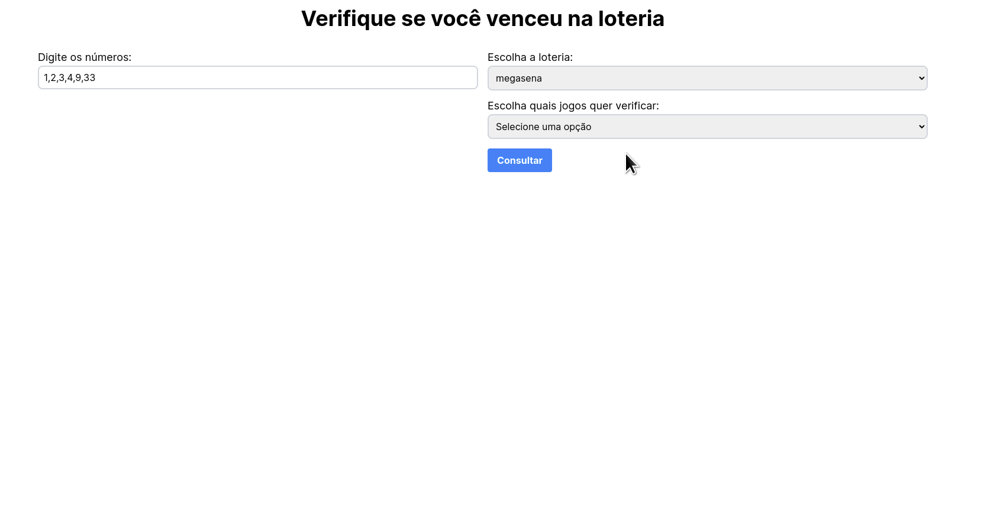
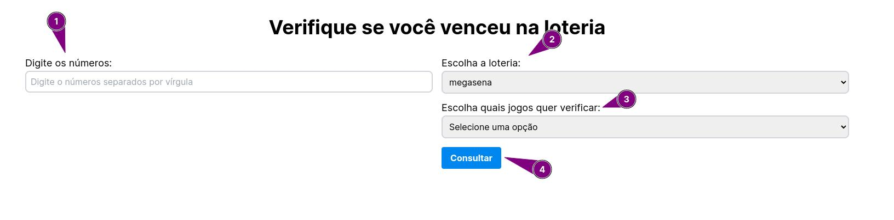

# 🎲 Projeto Confere-Loteria

O projeto permite que os usuários insiram números que tenham apostado na de loteria e verifiquem foram premiados. 

Os tipos de jogos de loteria disponíveis na aplicação são:

- Mega-Sena
- Lotofácil
- Quina
- Lotomania
- Dupla Sena

Na aplicação possível verificar o resultado de três formas:

- Último jogo da loteria
- Último jogo e de uma quantidade de jogos anteriores (ideal para apostas que usem a "teimosinha") 
- Jogo específico

A correção dos jogos é feita de forma automática, sendo que a verificação de cada jogo é mostrada de forma independente na tela, juntamente com a quantidade de acertos obtidas no jogo e uma informação que indica se com aquela quantidade de acertos é possível obter um prêmio ou não.

## 🔧 Como rodar o projeto

**Passos para execução local:**
1. Clone o repositório usando `git clone`.
2. Instale as dependências com `npm install`.
3. Inicie o servidor de desenvolvimento com `npm run dev`.
4. Acesse [http://localhost:3000](http://localhost:3000) no navegador.

**Alternativamente, você pode acessar o projeto online em **

## 🎯 Como usar o projeto

1. Insira seus números.
2. Selecione a loteria.
3. Escolha os sorteios para verificação.
4. Veja os resultados e celebre (ou não)!

## 🔗 Links úteis

- [API da loteria](https://github.com/guto-alves/loterias-api)
